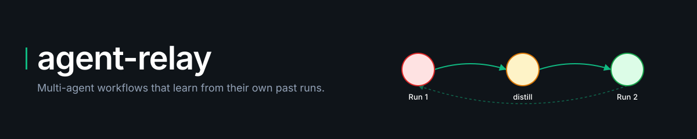
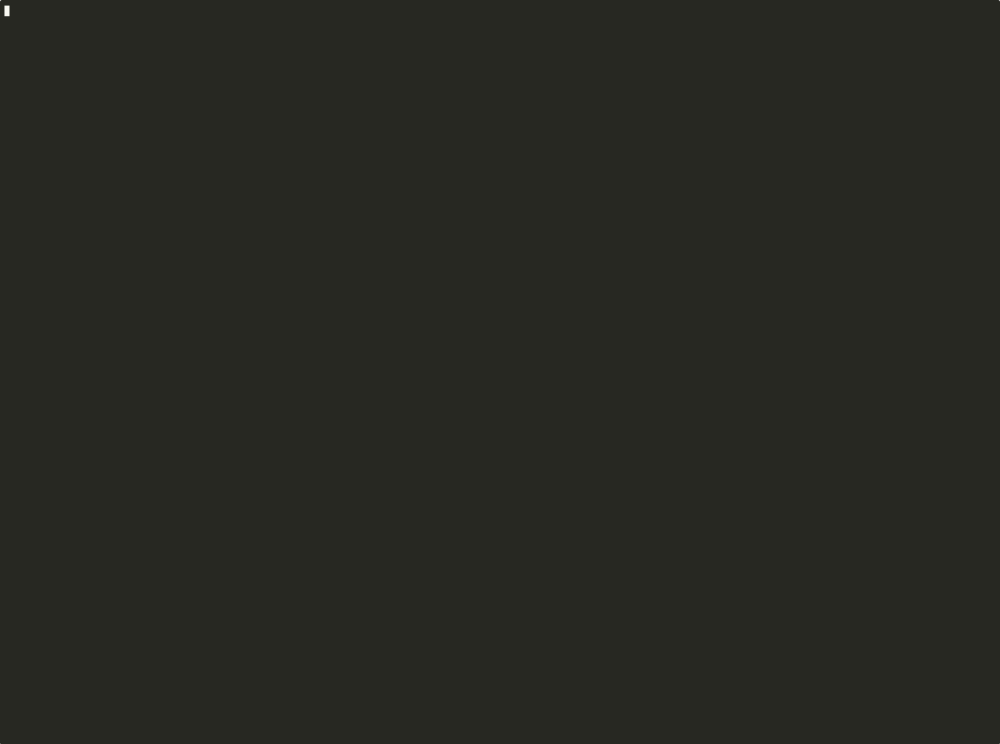
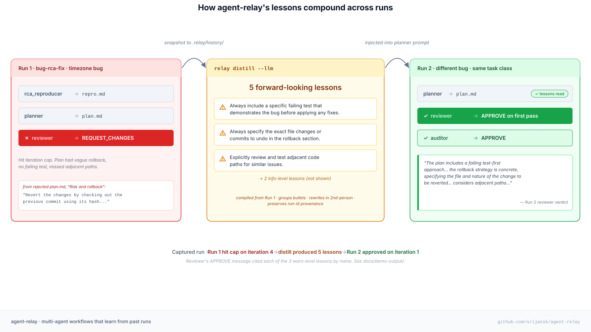
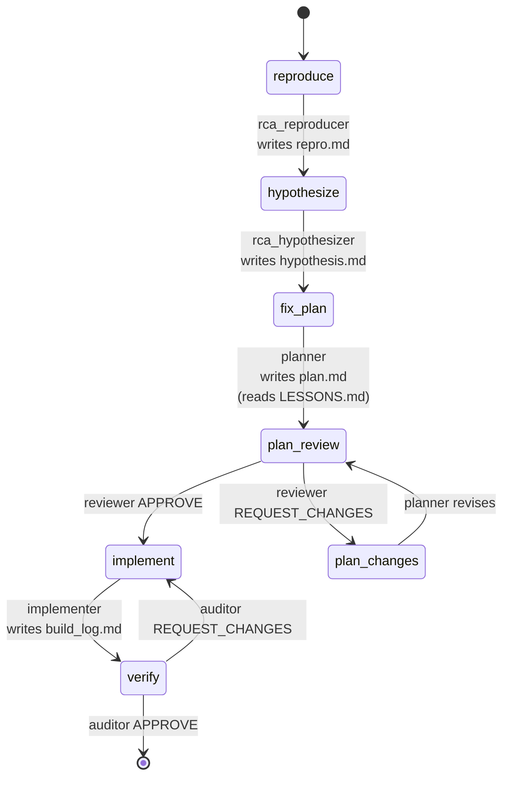

<p align="center">
  
</p>

# agent-relay

[](https://opensource.org/licenses/MIT)
[](https://www.python.org/downloads/)
[](#testing)

> **Multi-agent workflows that learn from their own past runs.**
> Plans, reviews, build logs, and audits land in your repo as committed
> artifacts. `relay distill` compiles them into role-typed lessons your
> next planner reads — so the same task class gets cheaper every time.

<!-- HERO_DEMO_START — replace with the animated demo once generated. -->
<p align="center">
  
</p>
<!-- HERO_DEMO_END -->

```bash
pip install git+https://github.com/srijansk/agent-relay.git
```

## How it actually compounds

<p align="center">
  
</p>

The loop closes when the reviewer's rejection on Run 1 becomes a lesson the
planner reads on Run 2. **No memory layer, no vector store** — just markdown
your team can edit, commit, and review like any other knowledge artifact.

## Captured proof

This isn't a thought experiment. From the run captured in
[`docs/demo-output/`](docs/demo-output/) against `gpt-4o`:

**Run 1** (no lessons) — planner gave a vague rollback ("revert the changes
by checking out the previous commit using its hash"), no concrete failing
test, missed adjacent paths. **Reviewer rejected.** Hit iteration cap.

`relay distill --llm` compressed the rejection into 5 forward-looking
lessons, the substantive ones being:

- "Always include a specific failing test in the plan to demonstrate the bug before applying any fixes."
- "Always specify the exact file changes or commits that need to be undone in the rollback section."
- "Explicitly include steps to review and test adjacent code paths for similar issues when addressing a bug."

**Run 2** (different bug, same task class, lessons in the planner's prompt) —
plan addressed all three proactively. **Reviewer APPROVED on first pass**,
verdict cited each lesson by name:

> *"The plan includes a failing test-first approach with specific tests... The rollback strategy is concrete, specifying the file and nature of the change to be reverted... considers adjacent paths that might be affected by similar issues..."*

That's the receipts. See [`docs/demo-output/README.md`](docs/demo-output/README.md)
for the full side-by-side. Reproduce on your own key with
[`scripts/capture-compounding-demo.sh`](scripts/capture-compounding-demo.sh).

## In 30 seconds

```bash
# Initialise a 5-stage bug-fix workflow (reproduce → hypothesise → plan → fix → verify)
relay init --template bug-rca-fix

# See the prompt for the active role
relay next                       # paste it into Claude Code, Cursor, Codex...

# After the agent writes its artifact, advance
relay advance

# When the workflow completes, it snapshots to .relay/history/<run-id>/.
# Compile lessons from accumulated history at any time:
relay distill                    # heuristic: parse rejection bullets, role-typed
relay distill --llm              # LLM-backed: groups bullets, rewrites in 2nd-person

# The next run on a similar bug will see those lessons in the planner's prompt.
```

Or let agent-relay drive the whole loop end-to-end with a backend:

```bash
export ANTHROPIC_API_KEY=...
relay run --loop --backend anthropic
```

A no-API-key walkthrough lives at [`docs/DEMO.md`](docs/DEMO.md).

## What's different

Every other multi-agent framework hides workflow state inside its runtime —
LangGraph checkpoints, CrewAI processes, Claude Code session files,
AGENTS.md as a single hand-written file. **agent-relay puts the state, the
artifacts, and the compiled lessons in your git repo as markdown.**

| | agent-relay | LangGraph / CrewAI / AutoGen | Claude Code subagents | AGENTS.md | agentic-stack |
|---|---|---|---|---|---|
| Workflow defined as | YAML | Python code | Markdown agents | One markdown file | SOUL.md configs |
| State lives in | `.relay/` (git) | Runtime / DB | Session store | n/a | `.agent/memory/` |
| Artifacts visible in PRs | **Yes** | No | No | n/a | Partial |
| Role-typed lessons compiled from past runs | **Yes** | No | No | No (one global file) | Memory layers, not workflow-typed |
| Tool-agnostic (Claude Code, Cursor, Codex, etc.) | **Yes** | Locked to its runtime | Claude Code only | Multi-tool but no workflow primitive | Multi-harness adapter |
| Human-edits-the-knowledge | **Yes** (LESSONS.md is markdown) | Indirect | Indirect | Yes | Via graduate / reject CLI |

## How a run flows

The state machine is a YAML file. Here is `bug-rca-fix` — the 5-stage flow
that produced the captured run above:



Every transition writes a markdown artifact that lives in your repo. When
the workflow reaches `[*]` (done), the run is snapshotted to
`.relay/history/<run-id>/` for `relay distill` to read.

## Templates (v0.2)

| Template | What it's for |
|---|---|
| [`bug-rca-fix`](src/relay/templates/bug_rca_fix/example) | 5-stage bug fix: reproduce → hypothesise → plan → review → implement → verify. Highest signal for the lessons loop because reviewer rejections and auditor catches are exactly what compounds. |
| [`rfc-then-implement`](src/relay/templates/rfc_then_implement/example) | Design-then-build: RFC → review → implement → audit. Useful for changes that need explicit alternatives + rollback before code is written. |
| [`plan-review-implement-audit`](src/relay/templates/plan_review_impl_audit/example) | The classic 4-role loop. Generic enough for most non-trivial features. |

Each template ships with a worked example — actual artifacts from a real run
plus the `LESSONS.md` that `relay distill` produced. **Read the example
before customising.**

## CLI

| Command | What it does |
|---|---|
| `relay init [--template NAME]` | Create a new workflow from a built-in template, or a minimal custom one |
| `relay status` | Print the current stage, active role, iteration counters |
| `relay next` | Print the prompt for the active role (with lessons auto-loaded if enabled) |
| `relay advance [--verdict approve\|reject]` | Advance the state machine after the role finishes |
| `relay run [--loop] [--backend NAME]` | Drive the workflow with a backend (manual / openai / anthropic / cursor) |
| `relay distill [--llm]` | Compile typed lessons from `.relay/history/` into `LESSONS.md` + `lessons.json` |
| `relay export claude-code` | Generate `.claude/agents/*.md` + `.claude/commands/relay-*.md` |
| `relay export cursor` | Generate `.cursor/rules/*.mdc` + prompts |
| `relay validate` | Check `workflow.yml` for errors |
| `relay reset [--clean]` | Reset to the initial stage (optionally wipe artifacts) |
| `relay dash` | Launch the TUI dashboard |

## Configuration

`.relay/relay.yml`:

```yaml
default_workflow: default
backend: manual                # manual | openai | anthropic | cursor
max_artifact_chars: 50000

history:
  enabled: true                # snapshot completed runs to .relay/history/

lessons:
  max_per_role: 10             # cap injected lessons per planner prompt

# Optional: backend config
backend_config:
  model: claude-sonnet-4-5
  temperature: 0.2
```

Per-role opt-in for lessons injection (`roles/planner.yml`):

```yaml
name: planner
system_prompt: |
  ...
inject_lessons: true            # default false
```

The shipped `bug-rca-fix`, `rfc-then-implement`, and
`plan-review-implement-audit` templates set this on planner / architect
roles. Other roles default to off — your choice when authoring custom
workflows.

## Testing

```bash
git clone https://github.com/srijansk/agent-relay.git
cd agent-relay
python -m venv .venv && source .venv/bin/activate
pip install -e ".[dev,openai,anthropic]"
pytest
```

165 tests across unit / integration / e2e. CI is fully deterministic: the
heuristic distillation does no network I/O, and the LLM-backed distillation
is unit-tested with an injected fake `llm` callable so no real API calls
are made during `pytest`. To exercise live LLM distill, set
`OPENAI_API_KEY` or `ANTHROPIC_API_KEY` and run `relay distill --llm`
against a populated `.relay/history/`.

## Status

- **v0.2.0** — persisted history, lessons compiler (heuristic + LLM), planner
  auto-load, two new templates (`bug-rca-fix`, `rfc-then-implement`),
  Claude Code exporter, captured compounding-effect demo.
- **v0.1.0** — file-based protocol, state machine, manual / OpenAI / Anthropic
  / Cursor backends, intelligent orchestrator.

See [CHANGELOG.md](CHANGELOG.md) and
[`docs/specs/2026-04-28-v0.2-design.md`](docs/specs/2026-04-28-v0.2-design.md)
for the design behind v0.2.

## Contributing

Open an issue to discuss what you'd like to change. PRs welcome — the same
`bug-rca-fix` and `plan-review-implement-audit` templates that ship in this
repo are how the maintainers ship features here.

## License

MIT — see [LICENSE](LICENSE).
